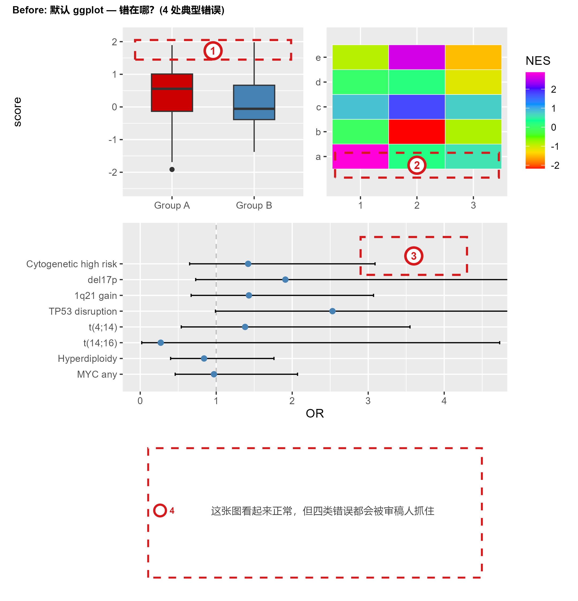
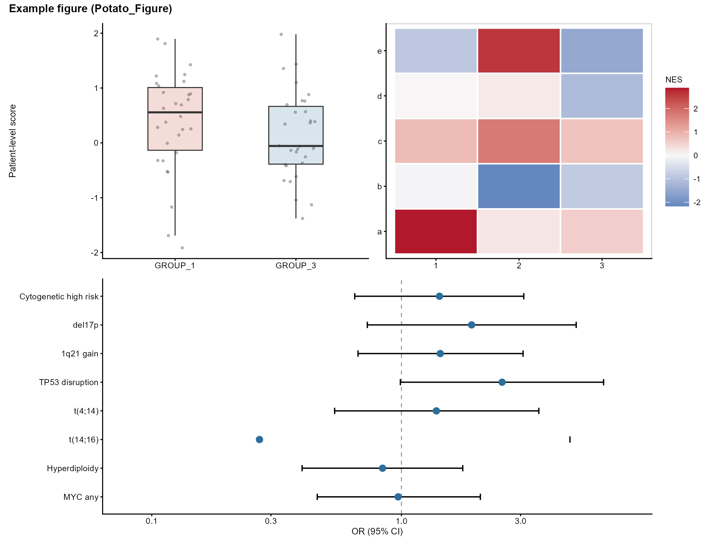

# Potato_Figure

发表级科研做图统一技能（Publication-Grade Scientific Figure Skill）。


> **Potato_Figure is not just a plotting theme.**
> It turns scientific evidence into publication-ready, traceable figure deliverables.
>
> **核心主张：AI 做科研图最可怕的不是丑，而是把错误画得特别漂亮。**
> Potato_Figure 不负责把图"变漂亮"，它负责把科研证据规范地变成
> 一套可提交、可追溯、可审计的 Figure deliverable。

> ⚠️ **v0.1.3-alpha（Pre-release）**
> - R backend：supported（示例全流程实测通过）
> - Python：experimental（暂无 Python 资产，仅规则层面）
> - journal-specific 尺寸：投稿前必须核对目标期刊官方指南
> - 当前 QA 是对 PNG 物理尺寸/四格式齐全性的静态预检，**不是**对
>   PDF/SVG/TIFF 内部元数据（字体嵌入、raster 有效 DPI 等）的完整审计
> - 本技能不替代统计学与领域专家审核

## Gallery（Before / After）

**Before 错在哪（错误标注版）**：默认 ggplot 看起来"正常"，但藏着一堆会被审稿人抓住的错误：

| 错误标注图 | Potato_Figure 合同化结果 |
|---|---|
|  |  |

| 维度 | Before（4 处典型错误） | After |
|---|---|---|
| 统计单位 | ❌ 未声明；细胞/视野可被误当 n | ✅ 患者/动物/独立实验才当 n，禁伪重复 |
| 原始数据 | ❌ 箱线图隐藏全部原始点 | ✅ 全部独立点保留 |
| 颜色 | ❌ 随意红蓝、彩虹热图（色觉不友好、0 点无语义） | ✅ 语义化颜色合同，跨图冻结 |
| 统计标注 | ❌ 森林图无 FDR / 无 n | ✅ 每 panel 统计合同可追溯 |
| 可追溯性 | ❌ 无 Source Data / manifest / QA | ✅ PDF/SVG/TIFF600/PNG + Source Data + manifest + QA |

> **不只是"丑 vs 好看"——是"错 vs 对"。** Potato_Figure 的核心是错误诊断：
> `scripts/audit_figure.R` 会逐条检查统计单位（伪重复）、n 完整性、检验声明、
> Source Data、四格式导出，输出"错在哪 + 怎么改"的报告。

## 特性

融合三套成熟规范：
1. **期刊出版级**（journal figure）：Figure Contract 五要素、backend 独占、archetype 分类、统一 R/Python quick-start。
2. **小论文主图规则**（manuscript main-figure rules）：压缩无效留白、bar 语法统一、证据叙事、模式图—数据紧邻。
3. **大论文发表级统一规则**（dissertation figure rules）：语义化颜色合同、物理尺寸/字号/线宽合同、定量图形语法、IHC/IVIS/WB 专项、正文准入与内部审计双轨。

> 核心立场：**图表服务于科学逻辑**；审美服从于结论清晰、可辩护、可审阅。

- **Figure Contract 先行**：动笔前先写核心结论、证据链、archetype、backend、导出合同五要素。
- **语义化颜色合同**：通用语义色（CONTROL/TREATMENT、UP/DOWN、HIGHLIGHT、GROUP_1-3）全文冻结，跨图不换色；项目专属色走 `profiles/` 机制。
- **物理尺寸与字号合同**：双栏 183 mm、单栏 89 mm；panel 字母 9–10 pt；期刊下限 5 pt、学位论文下限 7 pt。
- **统一 R 主题与导出**：`potato_theme.R` 一键载入主题；`save_fig()` 输出 PDF / SVG（可编辑文字）/ TIFF 600 dpi（LZW）/ PNG 300 dpi。
- **定量图形语法**：forest / heatmap / 配对点线 / 箱线+原始点 按场景选择；bar 只作均值背景且必须叠加全部独立点；统计合同（n、检验、FDR）逐 panel 可追溯。
- **图像 panel 专项**：IHC（患者为统计单位）、IVIS（anatomical proxy 边界）、WB（完整膜/曝光/重复溯源）。
- **数据完整性红线**：保留全部阴性结果；禁止伪重复、跨平台合并、结果驱动换 cutoff、模拟数据占位。
- **交付 QA 双脚本**：`validate_figure.R`（manifest/source data/四格式静态预检）+ `qa_physical_size.R`（物理尺寸实测）。

## 安装

克隆到任一 agent 的 skills 目录（以 opencode 为例）：

```bash
git clone https://github.com/Potato-AI0815/Potato_Figure.git \
  ~/.config/opencode/skills/Potato_Figure
```

重启 agent 后通过技能名 `Potato_Figure` 调用。R 依赖：`ggplot2`、`patchwork`、`svglite`、`ragg`、`png`（ComplexHeatmap/ggrepel 按需）。

## 快速开始

```r
source("examples/potato_theme.R")   # 主题 + 颜色合同 + save_fig() + qa_physical_size()
p <- ggplot(...) + potato_theme()   # 局部叠加主题
# 或全局：set_potato_theme()
save_fig(p, "output/my_figure", 183, 120)   # PDF/SVG/TIFF/PNG 四格式
Rscript scripts/qa_physical_size.R output    # 尺寸 QA
```

完整示例见 `examples/example_usage.R`（forest + heatmap + 分面面板 + source data + manifest）。

## 目录结构

```text
Potato_Figure/
├── SKILL.md                  # 技能主文件（规范全文 + 安装/用法）
├── README.md                 # 本文件
├── README_EN.md              # English
├── LICENSE                   # MIT
├── CHANGELOG.md
├── manifest.yaml             # 技能元数据
├── examples/
│   ├── potato_theme.R        # 统一主题、颜色、导出、尺寸 QA 函数
│   ├── example_usage.R       # 完整工作示例
│   ├── make_before_figure.R  # 生成 before（默认 ggplot）对照图
│   ├── make_annotated_before.R # 生成"错在哪"标注版 before 图
│   └── gallery/              # Before / After / 错误标注图
└── scripts/
    ├── validate_figure.R     # 交付前静态预检
    ├── qa_physical_size.R    # PNG 物理尺寸实测
    └── audit_figure.R        # 错误审计：报告"错在哪 + 怎么改"
```

## 使用建议

1. 每次做图先写 Figure Contract（SKILL.md §0），再写代码。
2. 颜色/尺寸/字号只从 `potato_theme.R` 调用，禁止面板内硬编码。
3. 导出后必须跑两个 QA 脚本，全部 PASS 才能交付。
4. 阴性、相反与不确定结果必须保留在 source data 或内部审计中。

## License

MIT — 可自由使用、修改、分发（见 LICENSE）。
